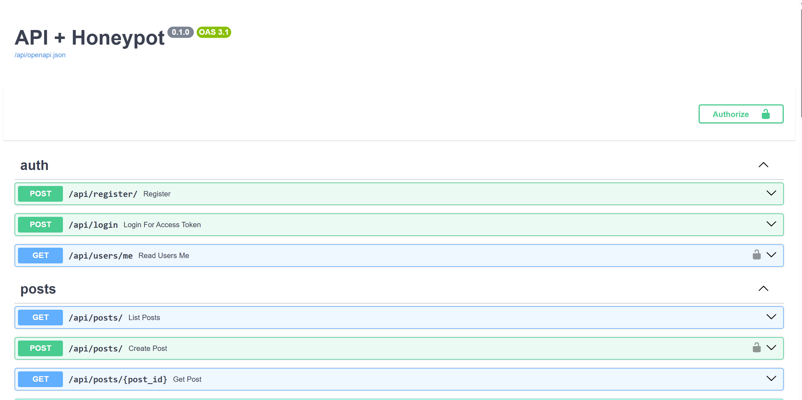
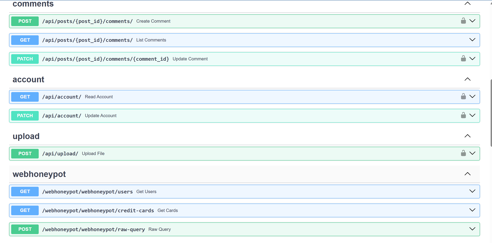
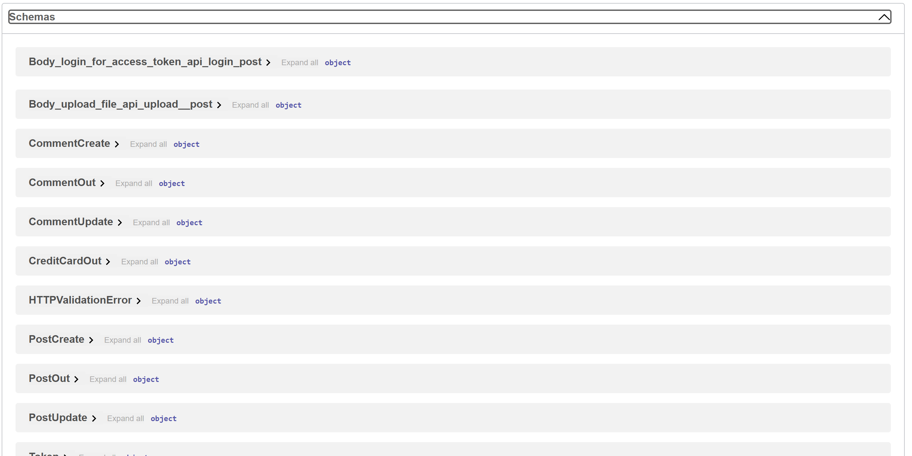
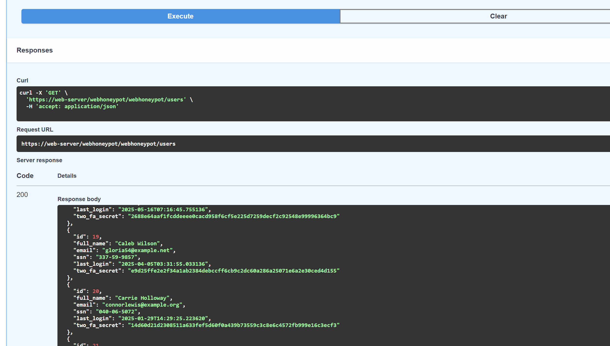
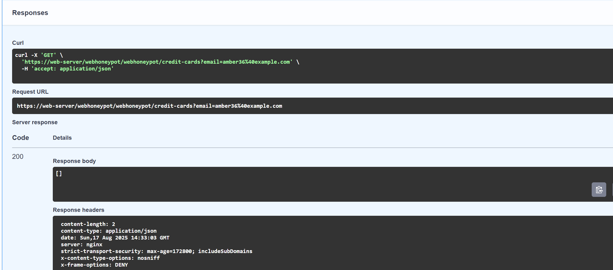
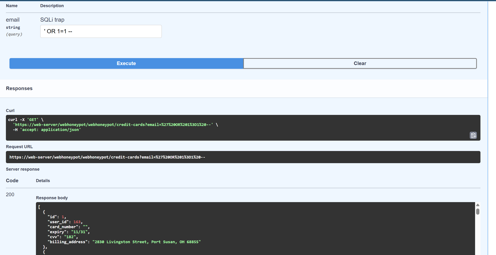
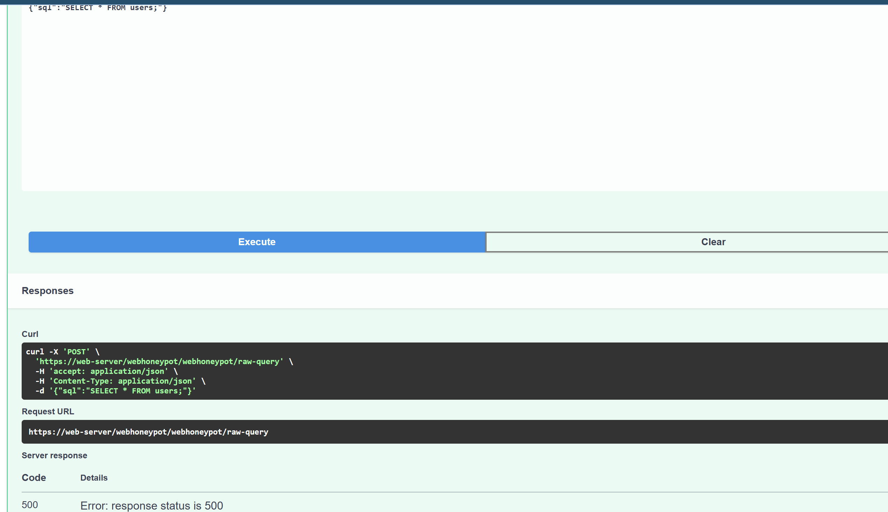

# README Honeypot project
A secure, interactive web honeypot environment designed to attract, analyze, and log malicious activities. The honeypot simulates realistic web application endpoints and includes a decoy database to entice attackers, capturing meaningful security logs for analysis.

## Overview
This project fulfills the following:
1. A secure web API with authentication, post/comment functionality, account management, and file uploads.
2. SSH honeypot (Cowrie) integrated with centralized log monitoring using Filebeat and Elastic Stack.
3. Web-based decoy database populated with sensitive dummy data designed to attract attacker attention.
4. Extensive security logging and best practices applied.

## Project Structure
````angular2html
ApiHoneypot/
├── apihoneypot.db         # Main SQLite database
├── decoy.db               # Decoy database for traps
├── build/                 # Build artifacts (PyInstaller, etc.)
├── dist/                  # Distribution packages
├── logs/                  # Application & honeypot logs
├── uploads/               # Uploaded files (monitored)
├── stub.py                # Entry stub (build/runtime helper)
├── stub-linux.spec        # PyInstaller spec file for Linux builds
├── venv/                  # Python virtual environment
│
└── app/                   # Core application code
   ├── __init__.py        # Marks app as a Python package
   ├── main.py            # FastAPI entry point (Uvicorn runs this)
   ├── config.py          # App configuration (settings, constants)
   ├── db.py              # Database connection/ORM for main DB
   ├── models.py          # SQLAlchemy models for main DB
   ├── decoy_models.py    # SQLAlchemy models for decoy DB
   ├── schemas.py         # Pydantic schemas for validation (main DB)
   ├── decoy_schemas.py   # Pydantic schemas for decoy DB
   ├── security.py        # Security logic (auth, tokens, etc.)
   ├── utils.py           # Utility/helper functions
   ├── patch.json         # Patch/config file for honeypot behavior
├── routers/           # FastAPI routers (API endpoints)
│   ├── __init__.py    # Router package marker
│   ├── account.py     # Account-related endpoints
│   ├── auth.py        # Authentication (login, tokens)
│   ├── comments.py    # Comments endpoints
│   ├── decoy_db.py    # Endpoints interacting with decoy DB
│   ├── edit.py        # Edit content endpoints
│   ├── posts.py       # Posts endpoints
│   ├── register.py    # User registration endpoints
│   └── upload.py      # File upload endpoints
│
└── __pycache__/       # Python bytecode cache (auto-generated)

````




## Key points

1. app/routers/ → modular FastAPI routers, each handling a specific feature.

2. decoy_db.py (router) → gives attackers something to poke at without harming real data.

3. Main/decoy DB split → apihoneypot.db vs. decoy.db helps separate real app logic from honeypot traps.

## Installation and Setup
Follow these clear steps to get the honeypot up and running.
1.  Step 1: Clone the repository
````angular2html
git clone https://your.gitlab.repo.url/ApiHoneypot.git
cd ApiHoneypot
````
2. Step 2: Set Up the Environment
Create and activate a Python virtual environment:
````angular2html
python3 -m venv venv
source venv/bin/activate
````

3. Step 3: Install Dependencies
````angular2html
pip install -r requirements.txt
````
4. Step 4: Configure Environment Variables
Create a .env file in the root directory:
````angular2html
DATABASE_URL="sqlite+aiosqlite:///./honeypot_main.db"
DECOY_DATABASE_URL="sqlite+aiosqlite:///./honeypot_decoy.db"
SECRET_KEY="SECURE_SECRET_KEY"
ALGORITHM="HS256"
ACCESS_TOKEN_EXPIRE_MINUTES=60
````
🌐 Running the Application
Launch the application with Uvicorn:
````angular2html
uvicorn app.main:app --reload --host 0.0.0.0 --port 8000
````
Verify your app is running by opening:
http://localhost:8000/docs

### Authentication and Endpoints
All endpoints (except login and registration) require JWT Authentication.
1. Register a User
````angular2html
   curl -X POST http://localhost:8000/api/register/ -H "Content-Type: application/json" -d '{
"name": "attacker",
"email": "example@example.com","password": "s3cr3tpass"
}'
````

2. Login
````angular2html
 curl -X POST http://localhost:8000/api/login \
  -H "Content-Type: application/x-www-form-urlencoded" \
  -d "username=attacker&password=s3cr3tpass"
````
Save the returned JWT token.


✅ Example use of other endpoints like post

````angular2html
curl -X POST http://localhost:8000/api/posts/ \
  -H "Authorization: Bearer $TOKEN" \
  -H "Content-Type: application/json" \
  -d '{"title":"Hello, world","body":"This is my first post."}'
````

### Honeypot Subsystem Components
The honeypot components of the project: the Web Honeypot API (decoy database exposed via FastAPI endpoints returning JSON only) 
and the SSH Honeypot (Cowrie) running on the same VM. It covers what they do, how to run them, how deception works, and how to test and collect logs.

#### Goals

1. Distract & observe adversaries with believable targets.
2. Generate high-quality logs for analysis (Elastic Stack).
3. Never expose real secrets — all data is fabricated (Faker) and sensitive fields are redacted on purpose.

#### Architecture Overview
#### Web Honeypot API

1. Tech: FastAPI (Python 3.11+), SQLAlchemy 2.x (async), SQLite (aiosqlite).
2. DB file: decoy.db (auto-created & seeded at app startup).
3. Logs:

   1. File log: logs/decoy_db.log (plain text of attacker queries).
   2. DB audit: db_changelog table (SQL payloads + IP + timestamp).

##### Endpoints:

1. GET /webhoneypot/webhoneypot/users
2. GET /webhoneypot/webhoneypot/credit-cards?email=...
3. POST /webhoneypot/webhoneypot/raw-query

Note: The double prefix is intentional in our wiring: a router with prefix="/webhoneypot" is included under an app prefix /webhoneypot, resulting in /webhoneypot/webhoneypot/....

#### Web Honeypot API – Deception Design

##### Decoy database simulates:

1. Users (names, emails, fake SSNs, 2FA secrets, last logins…)
2. Credit cards (numbers, expiry, CVV, billing address)
3. Bank accounts (account/IBAN, balances)
4. Payroll, API Keys, Secrets, Contracts

##### Users endpoint (GET /users):
Returns a list of decoy users in order the attacker is drawn in that there's something legit coming.


##### Credit cards endpoint (GET /credit-cards?email=...):
Benign-looking input returns [] after any use of email, in order to decieve the attacker that there's more if they try harder allowing collecting more logs

However, SQLi-looking input like ' OR 1=1 -- the vulnerable-looking query is executed for logging purposes, but the response redacts card_number (empty string). Everything else looks realistic, keeping attackers engaged to dig deeper


##### Raw Query endpoint (POST /raw-query):

Accepts {"sql":"..."}, always returns HTTP 500 with a randomized DB error message, but still logs the raw SQL payload (and IP).
Purpose: high-signal payload collection by simulating unstable / broken SQL behavior.


All SQL payloads are written to: logs/decoy_db.log

##### Summary of the webhoneypot

1. GET /webhoneypot/webhoneypot/users → list of decoy users.
2. GET /webhoneypot/webhoneypot/credit-cards?email=john@example.com → [] (empty; benign path).
3. GET /webhoneypot/webhoneypot/credit-cards?email=' OR 1=1 -- → redacted card numbers; payload logged.
4. POST /webhoneypot/webhoneypot/raw-query with body {"sql":"SELECT * FROM users;"} → 500 with randomized DB error; payload logged.

### SSH Honeypot Setup with Cowrie

A Debian/Ubuntu VM with root or sudo access.
The real SSH daemon moved to a non‐standard port 22222.
authbind installed to allow non‐root binding on low ports.
iptables installed for NAT redirection.
filebeat installed and configured for log forwarding.

#### Cowrie User & Dependencies

##### Update package lists:
````
sudo apt update
````
##### Install system dependencies:
````
sudo apt install -y git python3-venv python3-pip libssl-dev libffi-dev \
build-essential authbind
````
##### Create cowrie system user (no login shell):
````
sudo adduser --disabled-password --gecos "" cowrie
````
##### Clone Cowrie & Python Virtualenv

Switch to cowrie user:
````
sudo su - cowrie
````
Clone the Cowrie repository:
````
git clone https://github.com/cowrie/cowrie.git ~/cowrie
cd ~/cowrie
````
Create Python virtual environment:
````
python3 -m venv cowrie-env
source cowrie-env/bin/activate
pip install --upgrade pip
pip install -r requirements.txt
deactivate
````
##### Configure Cowrie

Edit the main config ~/cowrie/etc/cowrie.cfg:
````
[ssh]
listen_port = 2222
hostname = myhoneypot

[output_jsonlog]
enabled = true
````
Set up authbind for port 22:
````
sudo touch /etc/authbind/byport/22
sudo chown cowrie:cowrie /etc/authbind/byport/22
sudo chmod 755 /etc/authbind/byport/22
````
##### Port Remapping: Real SSH ↔ Honeypot

Move real SSH to port 22222 in /etc/ssh/sshd_config:
````
Port 22222
````
Restart your SSH daemon:
````
sudo systemctl restart sshd
````
Add NAT rule to redirect port 22→2222:
````
sudo iptables -t nat -A PREROUTING -p tcp --dport 22 \ -j REDIRECT --to-port 2222
````
##### Systemd Service with Wrapper

Create /etc/systemd/system/cowrie.service with:
````
[Unit]
Description=Cowrie SSH Honeypot
After=network.target

[Service]
Type=forking
User=cowrie
Group=cowrie
WorkingDirectory=/home/cowrie/cowrie
ExecStart=/home/cowrie/cowrie/bin/cowrie start
ExecStop=/home/cowrie/cowrie/bin/cowrie stop
KillMode=control-group
Restart=on-failure
RestartSec=5s

[Install]
WantedBy=multi-user.target
````
Enable and start:
````
sudo systemctl daemon-reload
sudo systemctl enable --now cowrie
````
##### Verify Cowrie is Running

Check service status:
````
sudo systemctl status cowrie
````
Confirm twistd listening on 2222:
````
sudo ss -tlnp | grep 2222
````
##### Test the Honeypot and tried some commands. It shows legitimate but it is not legit
````
ssh root@web-server -p 22
````
Result:
```
   adolatha@adolatha:~$ ssh root@web-server -p 22
   root@web-server's password:
   
   The programs included with the Debian GNU/Linux system are free software;
   the exact distribution terms for each program are described in the
   individual files in /usr/share/doc/*/copyright.
   
   Debian GNU/Linux comes with ABSOLUTELY NO WARRANTY, to the extent
   permitted by applicable law.
   root@myhoneypot:~# whoami
   root
   root@myhoneypot:~# ls /etc
   X11                       acpi
   adduser.conf              alternatives
   apt                       bash.bashrc
   bash_completion.d         bindresvport.blacklist
   blkid.tab                 blkid.tab.old
   calendar                  console-setup
   cron.d                    cron.daily
   cron.hourly               cron.monthly
   cron.weekly               crontab
   debconf.conf              debian_version
   default                   deluser.conf
   dhcp                      dictionaries-common
   discover-modprobe.conf    discover.conf.d
   dkms                      dpkg
   drirc                     emacs
   environment               fstab
   fstab.d                   gai.conf
   groff                     group
   group-                    grub.d
   gshadow                   gshadow-
   host.conf                 hostname
   hosts                     hosts.allow
   hosts.deny                init
   init.d                    initramfs-tools
   inittab                   inputrc
   insserv                   insserv.conf
   insserv.conf.d            iproute2
   iscsi                     issue
   issue.net                 kbd
   kernel                    kernel-img.conf
   ld.so.cache               ld.so.conf
   ld.so.conf.d              libaudit.conf
   locale.alias              locale.gen
   localtime                 logcheck
   login.defs                logrotate.conf
   logrotate.d               magic
   magic.mime                mailcap
   mailcap.order             manpath.config
   menu                      menu-methods
   mime.types                mke2fs.conf
   modprobe.d                modules
   motd                      mtab
   nanorc                    network
   networks                  nologin
   nsswitch.conf             opt
   os-release                pam.conf
   pam.d                     passwd
   passwd-                   profile
   profile.d                 protocols
   python                    python2.7
   rc.local                  rc0.d
   rc1.d                     rc2.d
   rc3.d                     rc4.d
   rc5.d                     rc6.d
   rcS.d                     resolv.conf
   rmt                       rpc
   rsyslog.conf              rsyslog.d
   securetty                 security
   selinux                   services
   shadow                    shadow-
   shells                    skel
   ssh                       staff-group-for-usr-local
   sysctl.conf               sysctl.d
   systemd                   terminfo
   timezone                  ucf.conf
   udev                      ufw
   vim                       wgetrc
   root@myhoneypot:~#
```

##### Log Shipping with Filebeat

Add to /etc/filebeat/filebeat.yml:
````
filebeat.inputs:
- type: log
  enabled: true
  paths:
   - /home/cowrie/cowrie/var/log/cowrie/cowrie.json
     json.keys_under_root: true
     tags: ["cowrie"]
````
Then:
````
sudo systemctl restart filebeat
````
Verify via:
````
sudo journalctl -u filebeat -f
````
##### Firewall Hardening

Use UFW or iptables to restrict real SSH (port22222) to your IP:
````
sudo ufw allow from 192.168.40.201 to any port 22222
sudo ufw allow 22/tcp
sudo ufw enable
````
##### Persistence and Maintenance
````
sudo apt install iptables-persistent
sudo netfilter-persistent save
````
