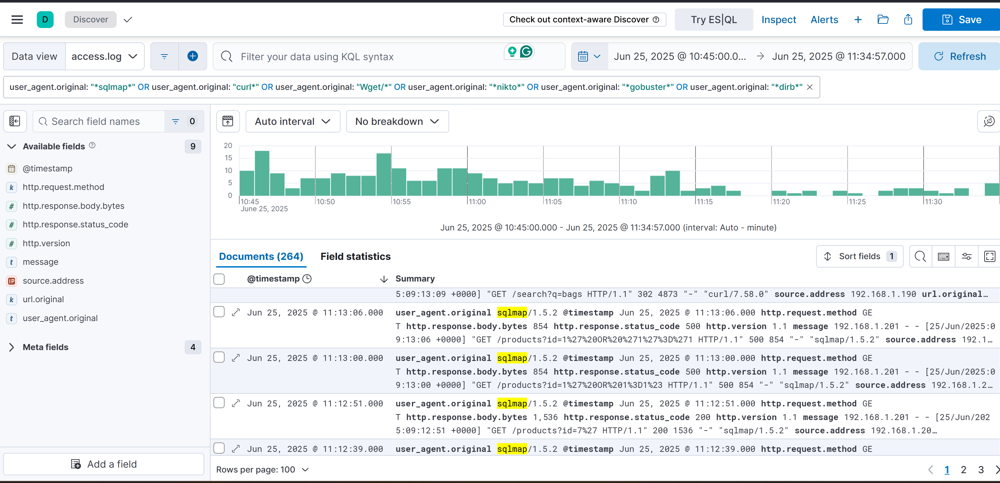
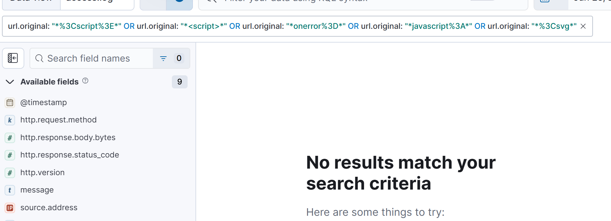
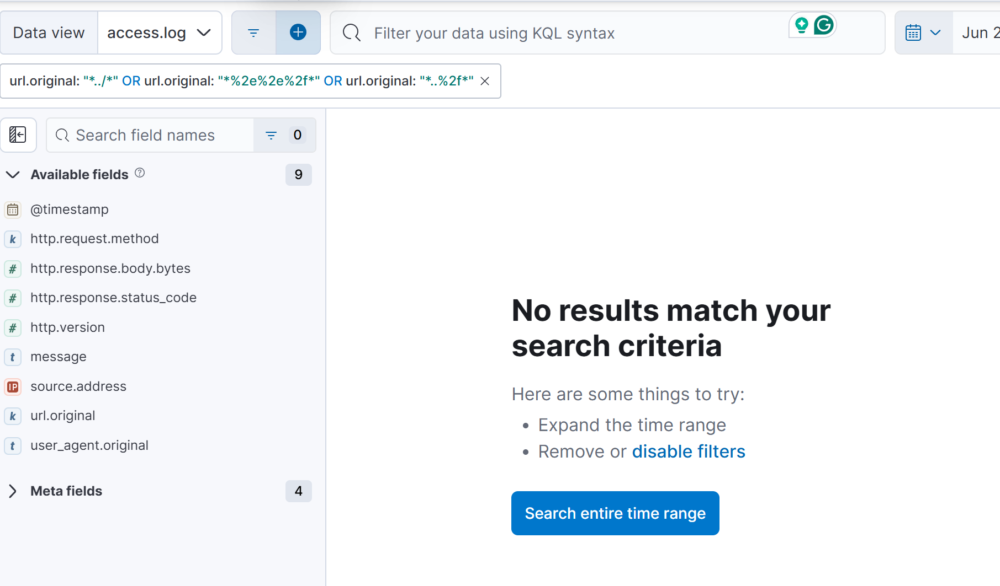
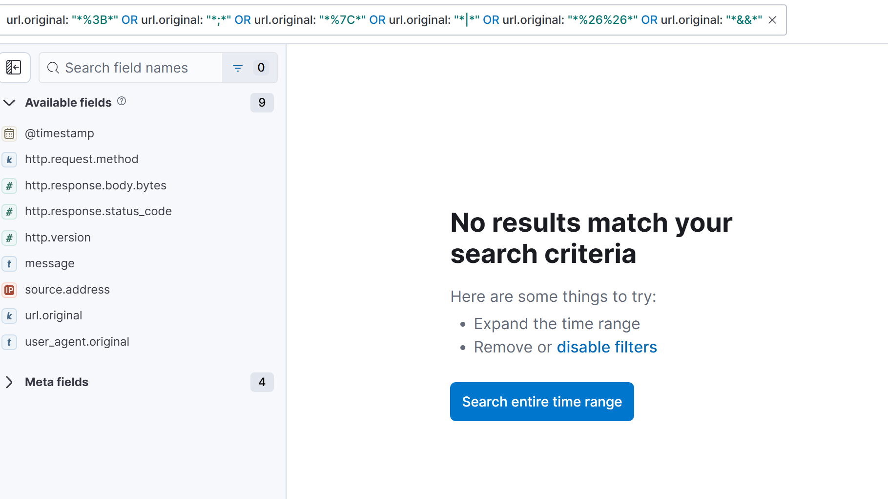
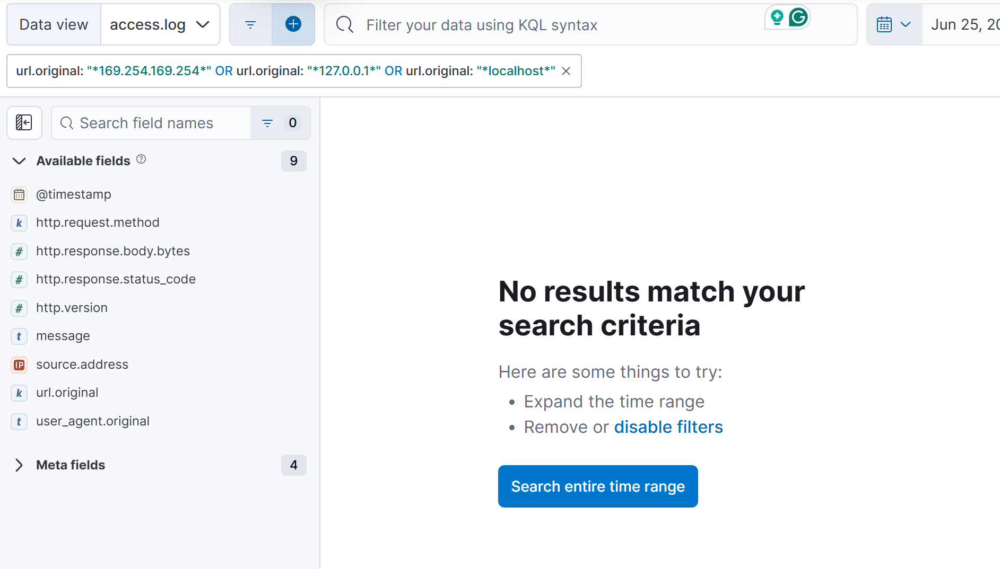
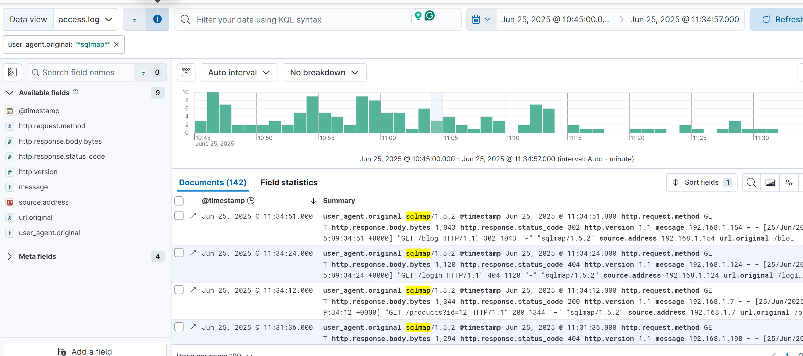
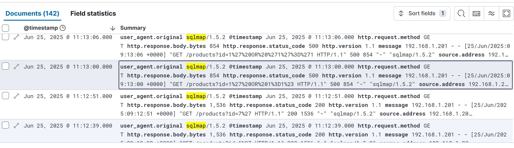

# Web Access Log Analysis — Step-by-Step
## Scope
1. Dataset: access.log (combined access format)
2. Available fields: 
@timestamp, 
http.request.method, 
http.response.body.bytes, 
http.response.status_code, 
http.version, 
message, 
source.address,
url.original, 
user_agent.original

3. Date: 25 June 2025

## High-level outcome 
### Primary suspicious activity: Automated SQL injection scanning (sqlmap/1.5.2).

1. Attack window: 08:45:19–09:34:51 UTC (10:45:19–11:34:51 CEST).
2. Key attacker IP: 192.168.1.201 (17 sqlmap hits; 10 SQLi payload attempts on /products?id=…; 5 of those returned HTTP 500).
3. Evidence of /admin probing (including 200 OK to sqlmap and curl). No proof of an authenticated admin session (no POSTs, no browser asset cascade).

### Initial sweep: Are there suspicious methods/tools (sqlmap, XSS, CSRF, etc.)?
1. Identified obvious scanners by User-Agent
```
user_agent.original : ("*sqlmap*" or "curl*" or "Wget/*" or "*nikto*" or "*gobuster*" or "*dirb*")
```
Observation: sqlmap/1.5.2 is present (142 events across multiple IPs). curl also appears, including against /admin.


2. Hunted the common payload patterns (XSS, traversal, SSRF, command-injection)
XSS indicators:
``
url.original : ("*%3Cscript%3E*" or "*<script>*" or "*onerror%3D*" or "*javascript%3A*" or "*%3Csvg*")
``
This returned nothing;


3. Path-traversal/LFI:
``
url.original : ("*../*" or "*%2e%2e%2f*" or "*..%2f*")
``
This returned nothing.


4. Command-injection hints:
``
url.original : ("*%3B*" or "*;*" or "*%7C*" or "*|*" or "*%26%26*" or "*&&*")
``


5. SSRF targets:
``
url.original : ("*169.254.169.254*" or "*127.0.0.1*" or "*localhost*")
``


Conclusion for Step 1: The only confirmed malicious technique in this log is SQL injection scanning (sqlmap). No XSS/CSRF/LFI/RFI/Command-Injection/SSRF patterns were found in URLs.

## Isolated the sqlmap activity (time, volume, status)
All sqlmap hits:
``
user_agent.original : "*sqlmap*"
``

Status found breakdown:
200: 48
302: 32
404: 31
403: 26
500: 5 ← important

## Verification of SQLi Payloads
Requests carrying classic SQLi signatures from sqlmap were identified:

1. Encoded single quote: %27
2. Boolean/tautology patterns: %20OR%20, +OR+
3. SQL comments: --, %23 (#)
4. UNION select probes: UNION%20SELECT

Key observation: Ten requests with clear SQLi signatures were recorded against /products?id=…. Of these, five returned HTTP 500, indicating the application raised errors under injected input (error‑based SQLi behavior)—the remaining returned 2xx/3xx and are not, by themselves, proof of exploitation.


The result shows that the source of the attacks was from ip 192.168.1.201. Findings about it:

1. 17 sqlmap requests total in the window.
2. 10 clear SQLi payload attempts against /products?id=….
4. 5 of those returned HTTP 500 like  %27 OR 1=1, comments -- / %23.


#### Intent: 
Automate SQL injection against product lookup by ID.
#### Success? 
No confirmed data extraction in this log. The most dangerous payloads caused 500 (application error) rather than a definitive 200/redirect with data. The 200s on simple %27 are not conclusive of exploitation.
The 500 status code however, shows that there’s a vulnerability in the SQL database which means with the right payload the attacker can exploit this vulnerability.

## Admin Probing Assessment
#### Requests to /admin were analyzed to determine exposure and potential misuse.
Findings:
/admin returned 200 OK to non‑browser user agents including sqlmap/1.5.2 and curl/*, demonstrating an exposed admin surface reachable by automation.
The dataset shows no POST operations to /admin (or related login endpoints) and no browser asset cascade (e.g., .css, .js, .png, .woff) following /admin, which would typically accompany a genuine interactive session.

Conclusion: /admin was probed and reachable but there is no evidence of a successful admin login in this log. The behavior is consistent with reconnaissance rather than a completed compromise.

## Final verdict

#### Attacker IP: 192.168.1.201
#### Technique: Automated SQL injection against /products?id=….
#### Impact in this log: Vulnerability indicated (500 errors on injected input), no confirmed data exfiltration.
#### Admin endpoint: Exposed and probed (200s to automation). No evidence of compromise, but needs hardening.


